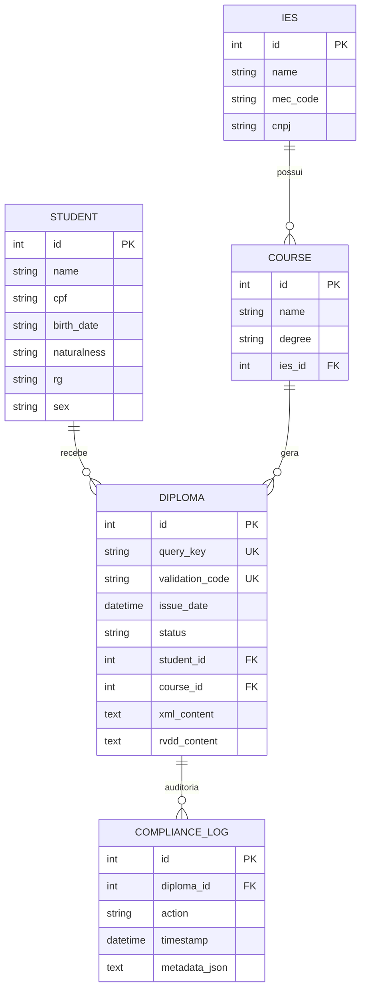

# Documentação Técnica - Backend Consulta de Diplomas

Esta documentação descreve a arquitetura, o modelo de dados e a API do sistema de consulta de diplomas digitais da Estácio (Clone), desenvolvido com FastAPI e PostgreSQL.

## 1. Arquitetura do Sistema

O sistema segue os princípios de **Clean Code** e a estrutura padrão para aplicações FastAPI:

- **FastAPI**: Framework web de alta performance.
- **SQLAlchemy**: ORM para interação com o banco de dados.
- **Alembic**: Gerenciamento de migrações de banco de dados.
- **PostgreSQL**: Banco de dados relacional.
- **Pydantic**: Validação de dados e serialização (Schemas).

### Estrutura de Pastas
```text
backend/
├── app/
│   ├── api/          # Definição das rotas e lógica de endpoint
│   ├── core/         # Configurações globais e variáveis de ambiente
│   ├── db/           # Configuração de conexão e sessão do banco
│   ├── models/       # Modelos SQLAlchemy (Tabelas)
│   ├── schemas/      # Modelos Pydantic (Validação/DTOs)
│   └── main.py       # Ponto de entrada da aplicação
├── scripts/          # Scripts utilitários (população de dados)
└── Dockerfile        # Configuração de containerização
```

## 2. Modelo de Dados

O banco de dados foi projetado para suportar os requisitos do MEC para diplomas digitais, incluindo metadados e logs de auditoria.

### Diagrama de Entidade-Relacionamento



## 3. API Reference

Todos os endpoints estão prefixados com `/api/v1`.

### Diplomas

#### Buscar Diploma por Chave
- **URL**: `/api/v1/diplomas/{query_key}`
- **Método**: `GET`
- **Resposta (200 OK)**:
  ```json
  {
    "id": 1,
    "query_key": "ESTACIO2024-AD-HGRS-7788",
    "validation_code": "ABC-123-XYZ-999000",
    "issue_date": "2024-04-09T03:00:48",
    "status": "Ativo",
    "student": { ... },
    "course": { ... }
  }
  ```

#### Download XML
- **URL**: `/api/v1/diplomas/{query_key}/xml`
- **Método**: `GET`
- **Descrição**: Retorna o arquivo XML com cabeçalho `Content-Disposition: attachment`.

#### Download RVDD
- **URL**: `/api/v1/diplomas/{query_key}/rvdd`
- **Método**: `GET`
- **Descrição**: Retorna o arquivo RVDD (Representação Visual do Diploma Digital).

#### Dados de Registro
- **URL**: `/api/v1/diplomas/{query_key}/registration`
- **Método**: `GET`
- **Descrição**: Retorna dados simplificados de registro e data de emissão.

## 4. Segurança e Auditoria

Cada vez que um diploma é consultado ou baixado, um registro é criado na tabela `compliance_logs`. Este log armazena:
- A ação realizada (`SEARCHED`, `XML_DOWNLOAD`, etc).
- Data e hora exata.
- Metadados do solicitante (IP e User Agent).

Isso garante a conformidade com as exigências de rastreabilidade de diplomas digitais.

## 5. Instruções de Execução

### Via Docker (Recomendado)
```bash
docker-compose up --build
```

### Popular Dados de Teste
```bash
docker exec -it diploma_app python scripts/seed.py
```
